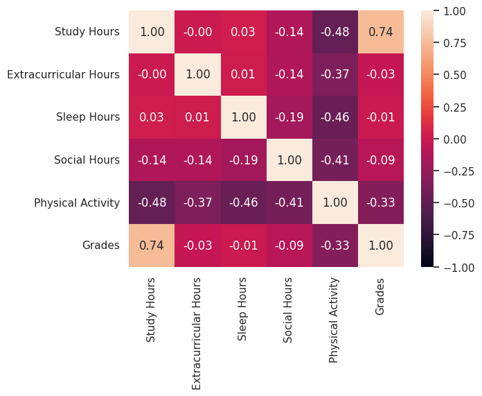
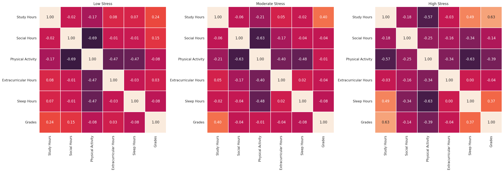

    <h1>Analyzing Factors Involved in Student Performance</h1>

[Original Dataset](https://www.kaggle.com/datasets/charlottebennett1234/lifestyle-factors-and-their-impact-on-students/code?datasetId=7103940)

# Part 1: Big Picture Patterns
When we look at a dataset, it's helpful to look at the bigger picture: we need to know what parts to dive into deeper. We have a bunch of continuous variables: Study Hours, Extracurricular Hours, Sleep Hours, Social Hours, Physical Activity Hours, and CGPA. We also have some categorical data: Gender and Stress levels. So we calculated correlation coefficients between each of the continuous variables.

Hmm. I wonder if things are any different if we group by stress levels.

We can see some difference. But what if we compare high stress students to everyone else?

Aha! We can indeed see that the relationships between some linear variables differs for high stress students versus everyone else!
