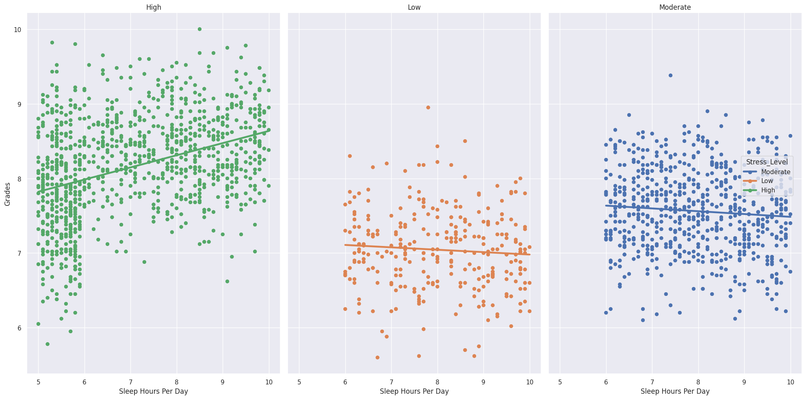
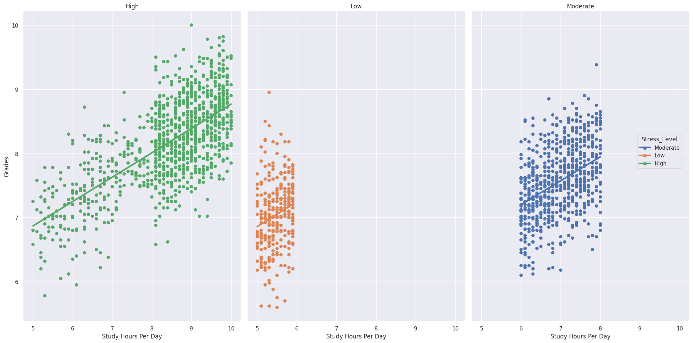
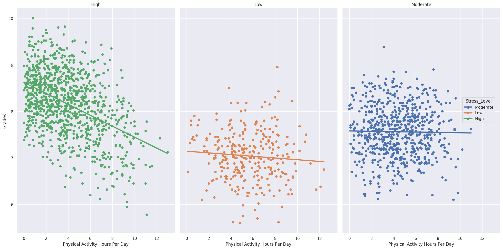

    <h1>Analyzing Factors Involved in Student Performance</h1>

[Original Dataset](https://www.kaggle.com/datasets/charlottebennett1234/lifestyle-factors-and-their-impact-on-students/code?datasetId=7103940)

# Methods
We used the pandas library to process the data and the popular library seaborn to create the data visualizations. 

# Results
We found a greater correlation between hours of sleep and grades for high stress students compared to other students, and hours spent studying were more correlated to high grades to high stress students than other students. Additionally, hours spent doing physical activity had much stronger of a negative correlation with grades for high stress students to other students. We also found that physical activity hours, sleep hours, and study hours affect grades the most, making them good targets for later predictive statistics or linear regression.

We also found that in this dataset, high stress students have better grades. 